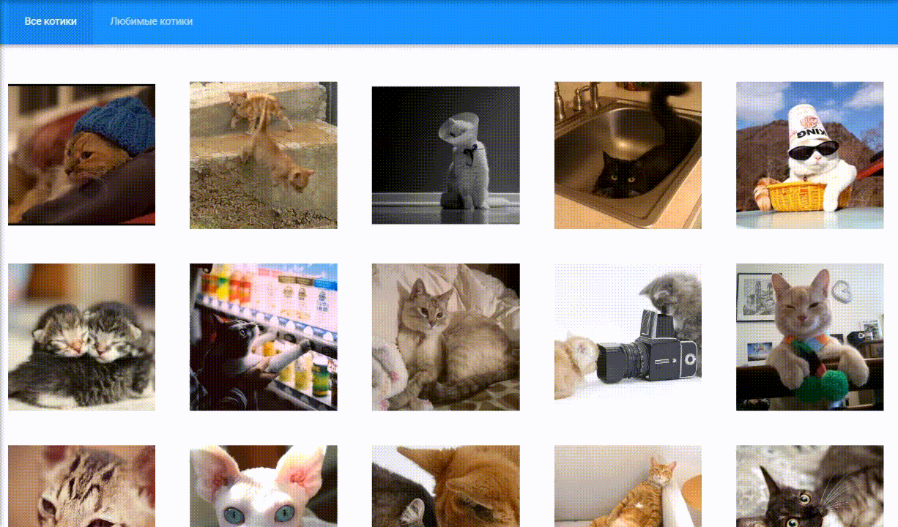

# 🐱 Кошачий Пинтерест

Веб-приложение для просмотра изображений котиков с использованием **The Cat API**. Пользователь может просматривать бесконечную ленту изображений, добавлять понравившихся котиков в избранное и управлять списком любимых изображений. Избранные котики сохраняются в **localStorage**, поэтому остаются доступными после перезагрузки страницы.

❗️❗️ Некоторый функционал приложения может быть недоступен в России.

🌐 [Демо проекта](https://bemfes.github.io/cat-pinterest/)

## 📸 Превью

<div>
    
</div>

## 🛠️ Стек

* React
* TypeScript
* React Router
* React Context
* CSS Modules
* FSD
* Vite

## 🎯 Функционал

* Просмотр изображений котиков
* Бесконечная прокрутка списка
* Добавление изображений в избранное
* Удаление изображений из избранного
* Сохранение избранного в localStorage
* Отображение скелетонов-заглушек до полной загрузки изображений
* Отдельная страница с избранными изображениями
* Страница 404 для несуществующих маршрутов

## 📡 API

Приложение использует [The Cat API](https://thecatapi.com) для получения изображений котиков.

## 🚀 Установка и запуск

1. Клонируйте репозиторий

```
git clone https://github.com/bemfes/cat-pinterest.git
```

2. Установите зависимости

```
npm install
```

3. Создайте .env файл в корне проекта и добавьте свой API-ключ 

```
VITE_API_KEY = YOUR_API_KEY
```

4. Запустите проект в режиме разработки

```
npm run dev
```

## 📬 Контакты

Анастасия Устин

* Telegram: @annastin28
* Email: anastasiia_ustin@mail.ru

## Исходное задание - Проект "Кошачий пинтерест"

Необходимо реализовать интерфейс для просмотра котиков используя API https://thecatapi.com

Дизайн лежит тут - https://bit.ly/3utxaL2

- по умолчанию должна открываться вкладка "все котики"
- у котика должна быть возможность добавить в "любимые" и убрать из "любимых"
- данные о "любимых" котиках должны хранится на клиенте
- на вкладке "любимые котики" должны отображаться добавленные в "любимые" котики
- реализация адаптивности будет плюсом, но не обязательна
- бесконечная прокрутка будет плюсом, но не обязательна
- можно использовать любой фреймворк включая vanilla.js